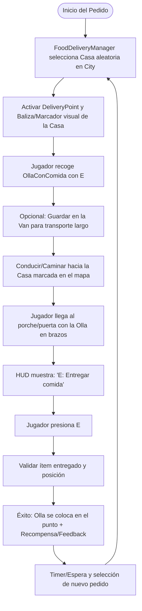
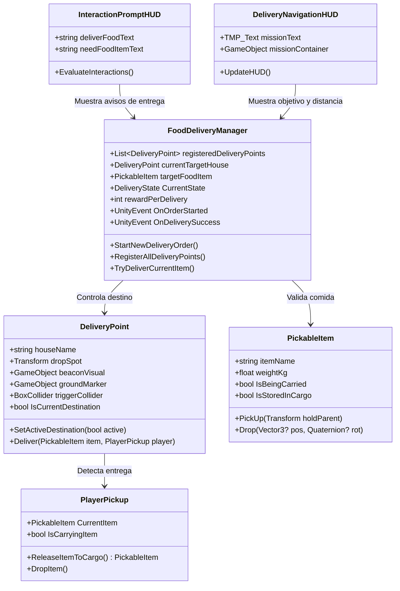

# 🛵 Plan de Implementación: Mecánica de Entrega de Comida ("A Toda Olla")

> **Documento de Referencia y Guía de Desarrollo**  
> **Proyecto:** A-Toda-Olla  
> **Objetivo:** Implementar el ciclo de juego para entregar comida (iniciando con `OllaConComida`) a una casa seleccionada al azar dentro de la ciudad (`City`), configurando puntos de entrega precisos en los prefabs de casas y proveyendo navegación e interacción intuitiva.

---

## 🗺️ Visión General y Flujo de Juego

---

## 🏛️ Arquitectura de Componentes

---

## 📅 Fases de Implementación

### 🔹 Fase 1: Componente `DeliveryPoint.cs` y Marcadores Visuales
- [x] **1.1. Script `DeliveryPoint.cs`**:
  - `Transform dropSpot`: Punto exacto donde reposa la comida entregada.
  - `BoxCollider triggerCollider`: Zona de detección del jugador (2.5m x 2.0m x 2.5m, isTrigger = true).
  - `GameObject beaconVisual`: Columna vertical visible desde la distancia.
  - `GameObject groundMarker`: Aro/cilindro en el suelo frente a la puerta que se ilumina al estar activo.
  - Métodos `SetActiveDestination(bool state)`, `CanDeliverItem(PickableItem item)`, `Deliver(PickableItem item, PlayerPickup player)`.
- [x] **1.2. Feedback en el punto de entrega**:
  - Soporte para sonido de entrega (`AudioClip deliverySuccessSound`) y partículas (`ParticleSystem deliveryParticles`).
  - Gizmos en el Scene view para depuración en el Editor.

---

### 🔹 Fase 2: Configuración en los Prefabs de Casas (`Assets/Prefabs/Houses/Nivel1/`)
- [x] **2.1. Prefabs involucrados**:
  1. `CasaTipo-A.prefab` -> localPos: `(5.189, 0.050, 3.753)`
  2. `CasaTipo-F.prefab` -> localPos: `(12.223, 0.050, 1.023)`
  3. `CasaTipo-I.prefab` -> localPos: `(-2.843, 0.050, -11.701)`
  4. `CasaTipo-K.prefab` -> localPos: `(-9.452, 0.050, -5.806)`
  5. `CasaTipo-M.prefab` -> localPos: `(13.573, 0.050, 8.214)`
  6. `CasaTipo-R.prefab` -> localPos: `(28.074, 0.050, -4.188)`
  7. `CasaTipo-T.prefab` -> localPos: `(2.438, 0.050, 2.327)`
- [x] **2.2. Posicionamiento del punto de entrega**:
  - Colocado automáticamente en el porche/frente de cada casa según la orientación del modelo 3D.
- [x] **2.3. Herramienta de Editor (`CityAlignmentTool.cs` / `HouseDeliveryPointSetupTool.cs`)**:
  - Menú `Tools/City Alignment/Setup Delivery Points on House Prefabs` ejecuta la configuración y genera reporte en `Assets/Delivery_Points_Report.txt`.

---

### 🔹 Fase 3: Controlador Central `FoodDeliveryManager.cs`
- [x] **3.1. Detección automática**:
  - Escanea `City` y registra automáticamente los 15+ puntos de entrega en la escena activa.
- [x] **3.2. Lógica de selección aleatoria**:
  - Escoge al azar un `DeliveryPoint` evitando repetir la misma casa consecutivamente.
- [x] **3.3. Control de la orden**:
  - Vinculado con `OllaConComida` (o cualquier `PickableItem`).
  - Manejo de estados: `WaitingForPickup`, `InTransit`, `Completed`.
- [x] **3.4. Ciclo de entrega**:
  - Recompensa por entrega (+$50 configurable).
  - Espera breve y asignación automática del siguiente pedido aleatorio.

---

### 🔹 Fase 4: Integración con Jugador y UI (`PlayerPickup` y `InteractionPromptHUD`)
- [x] **4.1. Detección en `PlayerPickup.cs`**:
  - Si el jugador lleva la comida en brazos y entra a la zona de entrega, al pulsar [E] se libera el ítem y se planta en el `DropSpot` de la casa.
- [x] **4.2. Avisos en `InteractionPromptHUD.cs`**:
  - Prioridad 3.5 añadida al HUD:
    - Con comida en brazos: `[E] Para entregar comida`.
    - Sin comida en brazos frente a la casa objetivo: `Trae la comida aquí para entregar`.
- [x] **4.3. UI de Estado de Misión**:
  - Script `DeliveryNavigationHUD.cs` integrado en `HUDCanvas`.

---

### 🔹 Fase 5: Brújula / Sistema de Navegación Waypoint
- [x] **5.1. Baliza en el Mundo (World-space Beacon)**:
  - Pilar vertical `BeaconVisual` y marcador en el piso `GroundMarker` que se encienden solo en la casa seleccionada.
- [x] **5.2. Indicador en Pantalla (HUD Waypoint / Banner)**:
  - Banner dinámico superior en `HUDCanvas` que muestra el objetivo actual y la distancia en tiempo real en metros (`📍 Entregar en: CasaTipo-M • 85 m`).

---

### 🔹 Fase 6: Extensibilidad Futura (Prefabs de Comida y Restaurante)
- [ ] Soporte para tipos variables de comida (pizzas, combos, etc.) cuando se creen nuevos prefabs.
- [ ] Spawn automático de comidas en el mostrador del restaurante.
- [ ] Sistema de propinas por tiempo de entrega.

---

## 📌 Progreso y Registro de Cambios

| Fecha | Fase | Descripción | Estado |
|---|---|---|---|
| 2026-09-30 | Planificación | Creación del plan de implementación y diseño de arquitectura | ✅ Completado |
| 2026-09-30 | Fase 1 | Creación de `DeliveryPoint.cs` con trigger, dropSpot y marcadores | ✅ Completado |
| 2026-09-30 | Fase 2 | Configuración e inyección en los 7 prefabs de casas de Nivel 1 | ✅ Completado |
| 2026-09-30 | Fase 3 | Creación de `FoodDeliveryManager.cs` y GameObject en escena | ✅ Completado |
| 2026-09-30 | Fase 4 | Integración con `InteractionPromptHUD.cs` y prompts contextuales | ✅ Completado |
| 2026-09-30 | Fase 5 | Creación e integración de `DeliveryNavigationHUD.cs` en `HUDCanvas` | ✅ Completado |
